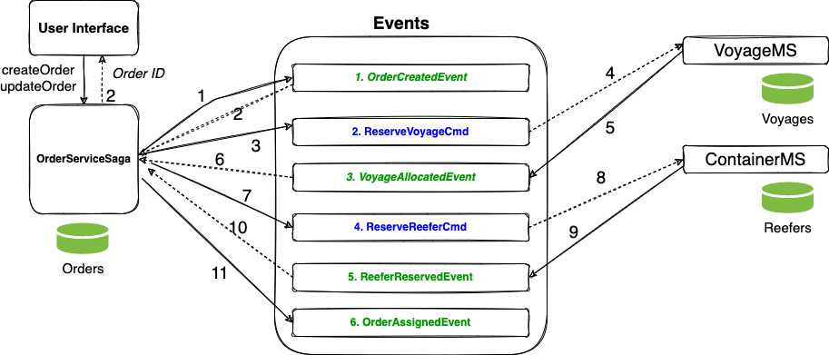

# Saga Orchestration demonstration

## Context

Introduced in 1987 [by Hector Garcaa-Molrna Kenneth Salem paper](https://www.cs.cornell.edu/andru/cs711/2002fa/reading/sagas.pdf) the Saga pattern helps to support a long running transaction that can be broken up to a collection of sub transactions that can be interleaved any way with other transactions.

With microservice each transaction updates data within a single service, each subsequent steps may be triggered by previous completion. 

## Implementation explanation

We have implemented the SAGA pattern in the Reefer Container Shipment Reference Application for the scenario where a customer creates an order to carry fresh goods from an origin port to a destination port. The Orchestration variant of the SAGA pattern, leveraging Kafka, involves strong decoupling between services, and each participants listen to facts and act on them independently. So each service will have at least one topic representing states on their own entity. In the figure below the saga is managed in the context of the order microservice in one of the business function like `createOrder`.


The figure above illustrates that each services uses its own topic in Kafka, so to manage the saga the Order service needs to listen to all participants outcome.

The happy path is illustrated diagram:



1. Upon the request to create an order, the OrderServiceSaga creates an order and sends an OrderCreatedEvent to the event broker.
2. The Saga receives an acknowledgement that the event has been succssfully published. 
3. The next order of things is to reserve a voyage. The Saga issues the command ReserveVoyageCmd.
4. The VoyagerMS microservice consumes this event which causes it to reserve a voyage.
5. With a voyage successfully reserved, VoyagerMS sends a VoyageAllocatedEvent to signal successful completion.
6. The saga consumes this event which prompts it to transition to the next activity
7. With a voyage booked we now need a reefer. The Saga reserves a reefer by issuing a ReserveReeferCmd command.
8. The ContainerMS is in charge of reefer reservations. It verifies availability of reefers, grabs a reefer and responds with a ReeferReservedEvent.
9. At this point all microservices have successfully executed and the saga ends the transaction with an OrderAssignedEvent.


### Code repositories

The new implementation of the services are done with Quarkus and Microprofile Messaging.

* [Order Microservice](https://github.com/ibm-cloud-architecture/refarch-kc-order-cmd-ms)
* [Reefer Microsercice](https://github.com/ibm-cloud-architecture/refarch-kc-reefer-ms)
* [Voyage Microservice](https://github.com/ibm-cloud-architecture/refarch-kc-voyage-ms)

Each code structure is based on the domain-driven-design practice with clear separation between layers (app, domain, infrastructure) and keep the domain layer using the ubiquituous language of each domain: order, reefer, and voyage.

```
│   │   │   └── ibm
│   │   │       └── eda
│   │   │           └── kc
│   │   │               └── orderms
│   │   │                   ├── app
│   │   │                   │   └── OrderCommandApplication.java
│   │   │                   ├── domain
│   │   │                   │   ├── Address.java
│   │   │                   │   ├── OrderService.java
│   │   │                   │   └── ShippingOrder.java
│   │   │                   └── infra
│   │   │                       ├── api
│   │   │                       │   └── ShippingOrderResource.java
│   │   │                       ├── events
│   │   │                       │   ├── EventBase.java
│   │   │                       │   ├── order
│   │   │                       │   │   ├── OrderCreatedEvent.java
│   │   │                       │   │   ├── OrderEvent.java
│   │   │                       │   │   ├── OrderEventProducer.java
│   │   │                       │   │   ├── OrderUpdatedEvent.java
│   │   │                       │   │   └── OrderVariablePayload.java
│   │   │                       │   ├── reefer
│   │   │                       │   │   ├── ReeferAgent.java
│   │   │                       │   │   ├── ReeferAllocated.java
│   │   │                       │   │   ├── ReeferEvent.java
│   │   │                       │   │   ├── ReeferEventDeserializer.java
│   │   │                       │   │   └── ReeferVariablePayload.java
│   │   │                       │   └── voyage
│   │   │                       │       ├── VoyageAgent.java
│   │   │                       │       ├── VoyageAllocated.java
│   │   │                       │       ├── VoyageEvent.java
│   │   │                       │       ├── VoyageEventDeserializer.java
│   │   │                       │       └── VoyageVariablePayload.java
│   │   │                       └── repo
│   │   │                           ├── OrderRepository.java
│   │   │                           └── OrderRepositoryMem.java
```

Events are defined in the infrastructure level, as well as the JAX-RS APIs.
### Compensation

The SAGA pattern comes with the tradeoff that a compensation process must also be implemented in the case that one, or multiple, of the sub transactions fails or does not achieve to complete so that the system rolls back to the initial state before the transaction began.

In our specific case, a new order creation transaction can fail either because we can not find a refrigerator container to be allocated to the order or we can not find a voyage to assigned to the order.

### No container


When a new order creation is requested by a customer but there is not a container to be allocated to such order, either because the container(s) do not have enough capacity or there is no container available in the origin port for such order, the compensation process for the order creation transaction is quite simple. The order microservice will not get an answer from the reefer manager, anf after a certain time it will trigger the compensation flow by sending a OrderUpdate with status onHold. The voyage service which may has responded positively before that, may roll back the order to voyage relationship.

### No voyage


This case is the sysmetric of the other one. The actions flow remains as expected for the SAGA transaction until the Voyages microservice is not answering after a time period or answering negatively. As a result, the Order Command microservice will transition the order to `OnHold` and emit an OrderUpdateEvent to inform the saga participants. In this case, the Reefer manager is one of those interested parties as it will need to kick off the compensation task, which in this case is nothing more than de-allocate the container to the order to make it available for any other coming order.

## Run locally

In this repository, we have define a docker compose file that let you run the demonstration on your local computer. You need podman or docker and docker compose.

```sh
docker-compose up -d
```

### Happy path demonstration

* Execute the create order

```sh
./e2e/sendGoodOrder.sh
```

```json
{ "orderID": "GoodOrder02",
  "productID":"P01",
  "customerID":"Customer01",
  "quantity":70,
  "pickupAddress":{"street":"1st main street","city":"San Francisco","country":"USA","state":"CA","zipcode":"95051"},
  "pickupDate":null,
  "destinationAddress":{"street":"1st horizon road","city":"Shanghai","country":"CH","state":"S1","zipcode":"95051"},
  "expectedDeliveryDate":null,
  "creationDate":"2022-05-16",
  "updateDate":"2022-05-16",
  "status":"pending"}
```

* Verify in Kafdrop the `orders` topic contains the expected CreateOrder event

```sh
chrome https://localhost:9000
```


* Verify in Kafdrop the `reefers` topic


* Verify the `voyages` topic


* The ShippingOrder should now be in assigned state as the order manager receives the two positive answers from the saga participant.


### Trigger the compensation tasks

The order has a pickup city set to Boston, and there is no reefer available at that location at that time, so the Reefer service is not responding to the order. The order microservice has two timers for each topics it subscribes to. If those timer sets, it looks at existing pending orders and trigget an OrderUpdateEvent with status onHold.

* Send an order from Boston

```sh
./e2e/sendNonPossibleOrder.sh
```

* Verify order created event reaches voyage and reefer microservices
* Voyage generates a event for voyages allocated.

## Deploy with Event Streams on OpenShift

TBD
